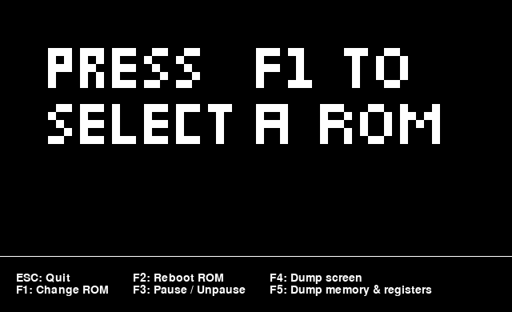

# Chip8 Interpreter (Emulator) in Python



## Keyboard

| 1 | 2 | 3 | C | → | 1 | 2 | 3 | 4 |
|---|---|---|---|----|---|---|---|---|
| 4 | 5 | 6 | D | → | q | w | e | r |
| 7 | 8 | 9 | E | → | a | s | d | f |
| A | 0 | B | F | → | z | x | c | v |

## Install & Run
Be sure to have Tkinter and pipenv (https://docs.pipenv.org/en/latest/install/#installing-pipenv) installed.

```
pipenv install
python chip8/chip8.py
```

## Ressources used
### Legacy
1. http://mattmik.com/files/chip8/mastering/chip8.html
2. http://www.cs.columbia.edu/~sedwards/classes/2016/4840-spring/designs/Chip8.pdf
3. Creating a Chip8 interpreter/emulator in C++14 by Bisqwit (https://www.youtube.com/watch?v=rpLoS7B6T94)

### New
3. http://www.multigesture.net/articles/how-to-write-an-emulator-chip-8-interpreter/
4. http://devernay.free.fr/hacks/chip8/C8TECH10.HTM
5. https://en.wikipedia.org/wiki/CHIP-8

Note that the legacy resources reference the original CHIP-8 implementation from 1970. Most games written post 2005 use the new implemtation as described by Cowgod (4.)<sup>1</sup>.

**Example: 8XY6**

*Legacy: Set VF = LSB(VY), then set VX = VY / 2*

*New: Set VF = LSB(VX), then set VX = VX / 2*

⚠️ This project implements the specification as seen in Cowgod's write-up(4). ⚠️

### Grafics & Sound
This project uses Pygame (https://www.pygame.org/news).

Beep sound belongs to pan14 (https://freesound.org/people/pan14/sounds/263133/).

### Octo IDE
The Octo IDE (https://github.com/JohnEarnest/Octo) was used to create the placeholder rom that is shown when no rom has been selected from the file dialog. Thanks to John Earnest for creating this amazing tool.


<sup>1</sup>https://www.reddit.com/r/EmuDev/comments/8cbvz6/chip8_8xy6/?utm_source=share&utm_medium=web2x
